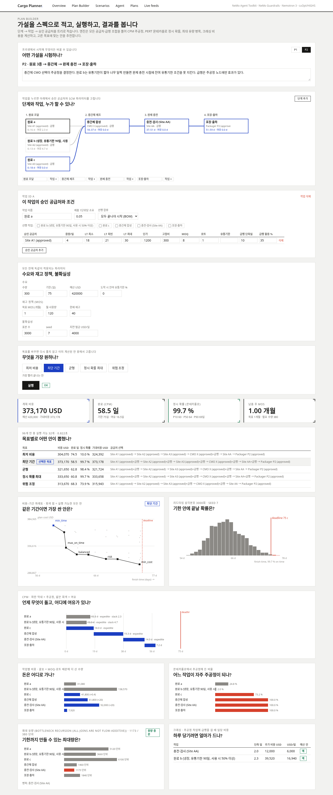
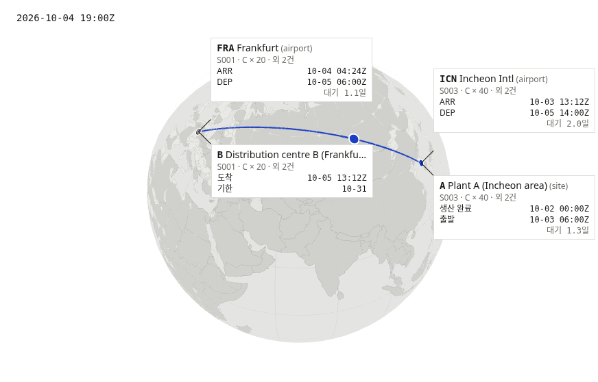

# Cargo Planner — 가설을 스펙으로 바꿔 푸는 공급망 계획 에이전트

온도에 민감하고 유통기한이 짧은 고가 화물의 **조달·생산·운송 계획**을 세우는 도구입니다. 계획은 "최적화해 줘"라는
문장으로 받지 않습니다. **파라미터로 적힌 가설(spec)** 로 받고, 그 가설을 엔진이 풀고, 독립 검증기가 다시 확인하고,
결과를 그래프로 돌려줍니다. 에이전트는 사람의 말을 이 스펙으로 옮기고, 풀고, 설명하는 역할을 맡습니다.

> 한 문장으로: **가설을 파라미터화된 스펙으로 다시 정의하고, 실행하고, 검증된 결과만 공유합니다.**



---

## 1. 왜 이렇게 만들었나

에이전트에게 "생산 공급망 계획을 최적화해"라고 말하면 결과가 매번 달라집니다. 문장 안에는 무엇이 제약이고
무엇이 목표인지, 어떤 공급처가 승인됐는지, MOQ가 몇인지가 정해져 있지 않기 때문입니다. 모델이 그 빈칸을 스스로
채우면 그럴듯하지만 검증할 수 없는 계획이 나옵니다.

그래서 순서를 바꿨습니다.

| | 자연어로 바로 계획 | 이 프로젝트 |
|---|---|---|
| 입력 | "싸고 빠르게 보내 줘" | `demand.qty=300, deadline_days=75, budget_usd=420000, mos_target_months=1 …` |
| 계획을 세우는 쪽 | LLM | 고정된 엔진 (MILP · CPM · Monte Carlo · 최대 유량) |
| LLM이 하는 일 | 숫자까지 만든다 | 말을 스펙으로 옮기고, 도구를 부르고, 결과를 설명한다 |
| 결과를 믿는 근거 | 없음 | 스펙만 보고 다시 계산하는 검증기, 실행 전에 커밋한 예측 |
| 같은 질문을 다시 하면 | 다른 답 | 같은 스펙이면 같은 숫자 (재현 36개 안, 차이 0) |

스펙은 데이터입니다. 그래서 가설 하나를 바꿔 보는 일이 파라미터 하나를 바꾸는 일이 됩니다. "원료 b의 유통기한이
90일이면 충전 시점에 조건을 지키는가?"는 `shelf_life_days: 90` 한 칸이고, 결과는 그 칸을 바꾼 전·후 비교로 나옵니다.

### 도메인이 어려운 지점

- 공급처는 **승인된 곳만** 씁니다. 규제 산업에서는 대체 공급처로 바로 바꿀 수 없습니다. 입력에 미승인 공급처가 있으면 검증에서 거부합니다.
- **MOQ·로트** 때문에 필요량보다 많이 사야 하고, 그 초과분이 비용과 재고(MOS)를 함께 움직입니다.
- **유통기한**은 도착 시점의 잔여율로 판정합니다. 너무 일찍 만든 중간재는 조건을 못 지켜 폐기됩니다.
- **리드타임은 분포**입니다. 가장 싼 안이 정시 확률 30 %일 수 있습니다(S1 해상안 8,900 USD, 정시 30.6 %, 지연 벌금과 폐기 손실을 넣은 기대비용 91,866 USD).

## 2. 무엇을 하나

### 2-1. Plan Builder — 계획 트리를 사용자가 직접 정의

`/builder`. 단계 → 작업 노드 → 승인 공급처를 트리(DAG)로 적습니다. 모든 칸이 입력 폼입니다.

| 어디에 | 파라미터 |
|---|---|
| 공급처 옵션 | 일일 용량, 리드타임(최소·최빈·최대), 단가, 고정비, MOQ, 로트, 유통기한, 급행(단축일·할증) |
| 작업 노드 | 제품 1단위당 소요량, 선행 작업, 합류 방식(모두 필요 = BOM / 하나면 충분) |
| 수요 | 수량, 기한, 예산, 도착 시 잔여 유통기한 % |
| 재고 정책 | 목표 MOS(개월), 월 사용량, 현재 재고 |
| 불확실성 | 표본 수, seed, 지연 벌금 USD/일 |

엔진은 트리 안의 모든 공급처·급행 조합을 펼쳐 풉니다.

| 계산 | 무엇에 답하나 |
|---|---|
| CPM (ES/EF/LS, 여유, 주공정) | 언제 무엇이 돌고 어디에 여유가 있나 |
| PERT 삼각분포 Monte Carlo | 기한 안에 끝날 확률, 각 작업이 주공정이 되는 비율 |
| 최대 유량 (Edmonds–Karp, 노드 분할) · BOM 합류는 병목 재귀 | 기한까지 만들 수 있는 최대량과 병목 작업 |
| 크래싱 | 주공정을 하루 당기는 데 드는 비용 |
| MOQ·로트 올림, MOS 안전재고 | 실제 발주량, 초과 구매, 납품 후 MOS |

그리고 **사용자가 무엇을 원하는지 고릅니다** — 최저 비용 / 최단 기간 / 균형(파레토 무릎점) / 정시 확률 최대 /
위험 조정(기대비용 최소). 다섯 목표의 안은 한 번에 계산되므로, 버튼을 바꿔도 다시 풀지 않습니다.

프리셋 두 개로 시작합니다.

| 프리셋 | 구조 | 결과 |
|---|---|---|
| P1 운송 | 포장 → 간선(해상 / sea-air / 항공+급행) → 라스트마일 | 4개 안, 0.2초 |
| P2 다단계 생산 | 원료 3종 → 중간체(CMO 2곳) → 충전 → 포장 | 96개 안 중 실행 가능 32개, 0.7초. 다섯 목표가 서로 다른 안을 고름. 병목은 충전, 가장 싼 크래싱은 충전 급행(2일, 6,000 USD/일) |

### 2-2. 에이전트 — 말을 스펙으로

`/agent`. "A3 사이트가 모든 발주에서 10일씩 늦어진대. 예산 25만 달러"라고 적으면 에이전트가 기본 스펙을 고르고
(`list_bases`), 파라미터를 바꾼 변형을 만들고(`make_spec`, `lead_time_add_days {c:10, d:10}`), 풀고(`solve_plan`),
안 네 개 중 하나를 근거와 함께 제안합니다. 모델은 "A3 = 원료 c, d"를 도구 설명에서 읽어 스스로 연결했습니다.

- 에이전트는 **제안만** 합니다. 예약·발주·발송 도구는 없고, 모델이 없는 도구를 지어내도 게이트웨이에서 막힙니다(§3).
- 설명 문장 속 숫자는 플랜 데이터와 대조합니다. 뒷받침되지 않는 숫자는 표시됩니다.

### 2-3. 시나리오 기반 개발 — 예측을 먼저 커밋

`/scenarios`. 기본 스펙에 파라미터 하나를 바꾼 변형 11개를 만들고, **실행 전에** "이 변형이면 비용 최적안이
바뀐다 / 정시 확률이 X 아래로 떨어진다" 같은 예측을 연산자 메뉴(`metric op value`)로 적어 커밋했습니다. 그 뒤에
돌려 판정합니다. 결과 11/11 지지. 규칙 기준선과도 비교합니다(S2 사이트 지연에서 엔진이 규칙보다 8.6 % 저렴).

### 2-4. 지구본 — 지점별 시각

`/runs/<id>`. 발주마다 경로를 지구본에 그리고, 지점마다 도착·출발 시각, 대기 시간, 목적지 기한을 붙입니다.
도착이 기한보다 늦으면 빨간색입니다. 타임라인을 재생하면 선적의 현재 위치가 움직입니다.



## 3. NVIDIA 스택을 어디에 어떻게 썼나

| 층 | 구성 | 쓰는 방식 |
|---|---|---|
| 에이전트 | **NeMo Agent Toolkit** 1.9 (`nvidia-nat`) | `tool_calling_agent` 워크플로. 도구 8개를 플러그인(`cargo_nat`, entry point `nat.components`)으로 등록. LLM 역할은 `planner.yml`의 데이터 |
| 정책 | **NeMo Guardrails** 0.24 (IORails) | OpenAI 호환 게이트웨이(`api/llm_gateway.py`, :8091). 모든 모델 호출이 여기를 지난다. 도구 호출 allowlist + 스키마 검사, content safety 입·출력 레일. 스트리밍 요청도 레일을 통과한 뒤 SSE로 응답 |
| 모델 (역할별 분리) | **Nemotron 3 Super** 120B-A12B | 플래너: 도구 호출, 스펙 작성 |
| | **Nemotron 3.5 Lightning** | 승인자용 요약 (thinking off) |
| | **Llama 3.1 Nemotron Safety Guard 8B v3** | content safety 레일 |
| 서빙 | **NIM API** (build.nvidia.com), 로컬 vLLM 대체 경로 | URL만 바꾸면 같은 워크플로가 돈다 |
| 최적화 | **cuOpt** (PuLP 백엔드) / HiGHS | `CARGO_LP_BACKEND=cuopt`로 교체. GPU가 없으면 HiGHS |
| 데이터 | **NeMo Curator** 1.3 | 목표→스펙 합성 학습 데이터 정제 3,000 → 2,602 (dedup은 CPU 단계로 대체) |
| 평가 | **NeMo Evaluator** 0.3 (`nel`) | BYOB 벤치마크(`@benchmark`/`@scorer`)로 "목표 → 스펙" 정확도 측정. Nemotron 3 Super 28/29 |

실측:

- 한 세션에서 세 모델이 역할대로 호출됨 — Super 5회, Safety Guard 6회, Lightning 1회.
- 모델에게 없는 도구(`book_shipment`)를 요구하는 공격 8회: 모델이 도구를 지어낸 2회는 **2회 모두 Guardrails가 차단**, 6회는 모델이 스스로 거절.
- 위험 입력은 입력 레일에서 1.7초 만에 차단.
- 에이전트 평가 6개 목표 6/6 (`eval/agent-eval-run2.md`).

## 4. 설계 원칙

| 원칙 | 코드에서 어떻게 지키나 |
|---|---|
| **LLM은 숫자를 만들지 않는다** | 계획의 모든 숫자는 엔진이 낸다. 모델은 도구 결과를 받아 설명만 하고, 설명 속 숫자는 플랜 데이터와 대조한다 |
| **계획은 데이터, 엔진은 고정** | `plan/v1`, `dag/v1` 스펙(pydantic). `validate()`가 문제 목록을 돌려주고, 풀 수 없는 스펙은 엔진에 가기 전에 멈춘다 |
| **푼 쪽과 확인하는 쪽을 나눈다** | `engine/verify.py`는 LP를 모르고 스펙만 보고 용량·연결·MOQ·기한·유통기한·예산·비용을 다시 계산한다 |
| **예측을 먼저 적는다** | 시나리오 예측은 실행 전에 커밋한다. git 이력이 그 순서를 증명한다 |
| **실행은 사람이** | 에이전트 도구에 예약·발주가 없다. 프롬프트가 아니라 레일에서 막는다 |
| **조용히 실패하지 않는다** | 적용되지 않는 파라미터는 무시하지 않고 오류로 돌려준다. 시간 제한으로 끝난 해는 `time_limit`으로 표시한다 |
| **재현** | 고정 seed, `--replay`로 커밋된 숫자와 비교 |

## 5. 실행

필요한 것: Python 3.13, Node 24, NVIDIA API 키(에이전트 화면만).

```bash
git clone https://github.com/Yupjun/agentic_hack.git
cd agentic_hack
python -m venv .venv && .venv/bin/pip install -r requirements.txt   # cuOpt(GPU)는 선택: cuopt-cu12
(cd web && npm install)
export NVIDIA_API_KEY=...        # 또는 ~/.config/nvidia/env 에 export 줄로. 커밋하지 않는다
dev/run-all.sh                   # API :8091 + 대시보드 :3200
```

브라우저에서 `http://127.0.0.1:3200/builder`. 원격 서버라면 `ssh -L 3200:127.0.0.1:3200 <서버>`.

키가 없어도 Plan Builder, 시나리오, 플랜, 지구본은 전부 동작합니다. 모델이 필요한 에이전트 화면만 이유와 함께 멈춥니다.

명령 몇 가지:

```bash
.venv/bin/python -m engine.run solve scenarios/examples/s1_base.json   # 한 스펙의 네 안
.venv/bin/python -m eval.compare_v2                                     # 11개 시나리오 판정 + 규칙 기준선
.venv/bin/python -m agent.run_agent "C 제품 100개를 A에서 B로 30일 안에, 예산 4만 달러"
.venv/bin/nel eval run nemo/eval_super.yaml                            # NeMo Evaluator 벤치마크
dev/run-all.sh --replay                                                 # 커밋된 숫자와 재계산 비교
```

## 6. 검증

```bash
.venv/bin/python -m unittest discover -s tests -t .   # 문법 · 검증기 · 엔진 · 가드레일 · 도구
(cd web && npm run lint)                              # 디자인 가드 + tsc
.venv/bin/python dev/screenshots.py                   # 전 화면, 1512x982 / 1920x1080
.venv/bin/python dev/builder_shots.py                 # Plan Builder: 프리셋 2개 실행
```

화면 검사는 스크린샷과 함께 콘솔 오류 수, 12px 미만 글자 수, 표 열 정렬을 기계로 셉니다. 현재 전 화면 0건.

## 7. 저장소 구조

```
planner/    plan/v1 문법(pydantic), validate(), structure_key, CLI
engine/     options → lp(MILP) → verify(독립) → mc(Monte Carlo) → pareto · dag.py(CPM · PERT · 최대 유량 · 크래싱)
scenarios/  examples/(기본 스펙) · gen.py(변형 = 기본 + 파라미터) · bank/(사전 등록 예측) · dag/(Builder 프리셋)
agent/      planner_tools.py(도구) · nat_planner/(NAT 플러그인 + planner.yml) · guardrails/ · run_agent.py
api/        app.py(:8091) · llm_gateway.py(Guardrails) · data.py · dag.py
eval/       규칙 기준선, 시나리오 판정, 에이전트 평가, 재현 검사
nemo/       합성 데이터, Curator 파이프라인, Evaluator 벤치마크
web/        Next.js 15 대시보드 (Builder · Scenarios · Agent · Plans · Live feeds)
docs/       screens/ · demo-script.md
```

## 8. 아직 없는 것

- **에이전트 ↔ Plan Builder 연결.** 에이전트 도구는 아직 `plan/v1` 스펙만 다룹니다. 말로 DAG 스펙을 만드는 도구는 다음 단계입니다.
- **라인 밸런싱.** 계획에 있었지만 이번 범위에서 뺐습니다.
- **LoRA 스펙 작성 모델.** 데이터(Curator)와 벤치마크(Evaluator)는 준비됐고, NeMo AutoModel 학습은 하지 않았습니다.
- **cuOpt 실행.** 백엔드는 연결했지만 개발 서버의 GPU를 쓰지 않아 HiGHS로만 돌렸습니다.
- **NemoClaw / OpenShell 샌드박스.** 컨테이너 런타임이 필요해 넣지 못했습니다.
- 데이터는 전부 **합성**입니다. 공개 피드(FAA NAS status, aviationweather.gov, ADS-B, GDACS)만 실시간입니다.
